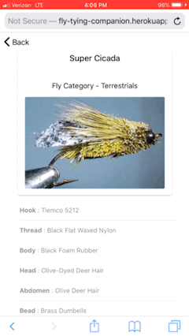

# Fly Tying Companion User Interface
## This project contains the user interface files for the Fly Tying Companion web application. 

>**[Fly Tying Companion](https://fly-tying-companion.herokuapp.com).**

The Fly Tying Companion is an app that assists fly fisherman/fly-tyers by allowing them to quickly see what flies they can tie based off the materials they've selected in the app. The app will allow a user to input materials they own and then the app will then return the flies they can tie based on the inputs they made. The application was built primarily for **mobile** devices, but will work fine on desktops as well. 

**Home Page** | **Browse Flies** | **Fly Details**
------------ | ------------- | -------------                  
 |  | 

Much like a recipe/cooking application helps you find dishes to make with the unused ingredients you have, the Fly Tying Companion will help you find flies and their patterns with some of the unused fly-tying materials you have left over. 

**To use the app:**
* Scroll to the 'Add Materials' section
* Start by clicking a material category
* Select as many materials as you want
* Hit the submit button and flies with selected materials will load
* Hit reset to start over and clear form/flies
* Can browse all the flies by using the menu and selecting 'Browse Flies'

The Fly Tying Companion was built using Ionic/Angular for the front end, MongoDB for the database and Node.js/Express for the REST API. 

The Documentation folder contains all the design documents used before development began on the app. The code files are mainly housed in the 'src' folder, which contains all the HTML, CSS, and TypeScript files. A simple Node.js/Express file, 'server.js', was used for hosting/deployment on Heroku. 

